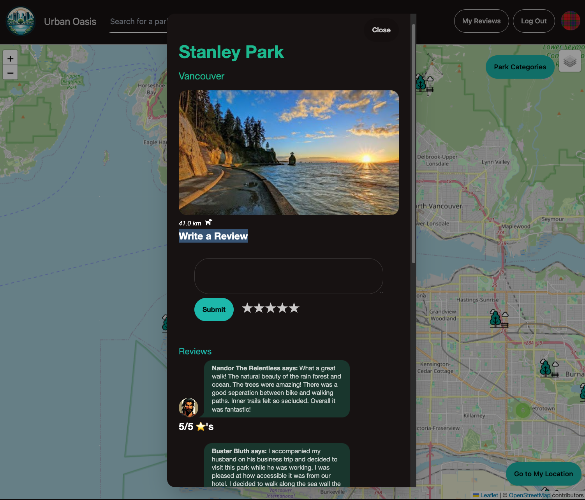
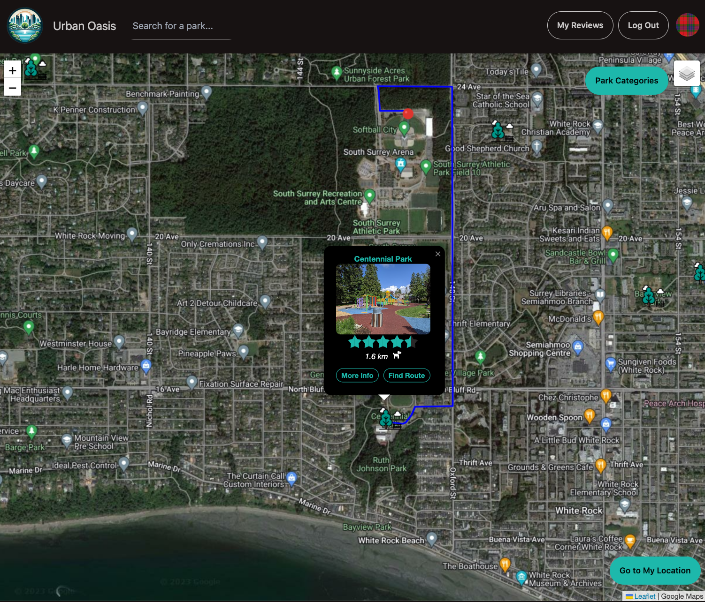
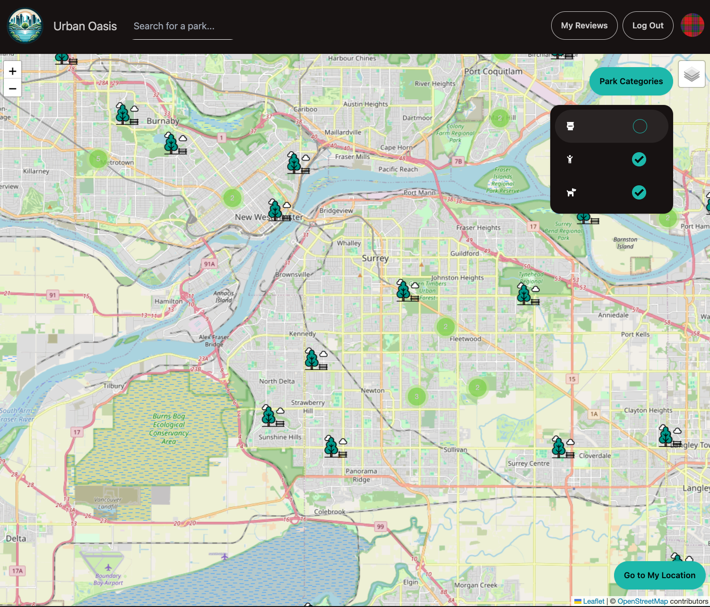

# Urban Oasis - Lighthouse Labs Final Project

Urban Oasis (UO) is a single page map application for finding parks in your area. You can filter your view of parks by three categories: child friendly, bathroom friendly, and dog friendly. UO uses external API calls to provide the user with park images, locations, and reviews. You can leave reviews for parks, search for parks with auto-suggesting park names, and get directions to a park. This project was built by Mitch Johnston, Yiqun (Albert) Huang, and Steve Fraser.

## Getting Started

1. To get started create the `.env` file in the server directory by using `.env.example` as a reference: `cp .env.example .env`

2. Update the .env file with your correct local information. You will need to acquire your own Google Places API key

- username: `username``
- password: `password`
- database: `urban_oasis`

3. Install dependencies in the client and server folders: `npm i` 

4. Run `npm start` in the server directory before running seed command.

5. Reset database: `npm run db:reset`

6. Run the frontend server from the client directory: `npm start`

7. Visit `http://localhost:8080/` and enjoy.

## Features

- Browse parks as a guest or login using Auth0 with the  option of using your existing Google, Github or Apple account
- Use the auto-suggesting search bar or manually search the map to find a park
- The search bar allows you to select a map and zoom to that location
- The "Park Categories" button allows you to filter your view of parks to find the kind you are looking for (child, dog or bathroom friendly)
- As a user, you can write reviews for parks and manage all your reviews under the "My Reviews" button that only appears when a user is logged in
- The browser will ask permission to use your location and then render parks in your area
- You can click on parks to see a pop up containing a primary image of the park, it's rating out of 5, the distance away, which categories the park falls into and two buttons for "More Info" and "Find Route"
- The "More Info" button will open a modal with a carousel of user submitted park images, the option to leave a review, and recent user reviews by others
- The "Find Route" button with generate a route originating from your location to the selected park
- The map has multiple veiws including Open Stree view, Satelite view, and Watercolor
- Use the "Go to My Location" to return to your location on the map

## Dependencies
- @auth0/auth0-react: ^2.2.3
- @fortawesome/fontawesome-free: ^6.5.1
- @fortawesome/fontawesome-svg-core: ^6.5.1
- @fortawesome/free-regular-svg-icons: ^6.5.1
- @fortawesome/free-solid-svg-icons: ^6.5.1
- @fortawesome/react-fontawesome: ^0.2.0
- @headlessui/react": ^1.7.17
- @testing-library/jest-dom: ^5.17.0
- @testing-library/react: ^13.4.0"
- @testing-library/user-event: ^13.5.0"
- auth0-lock: ^12.3.1"
- axios: ^1.6.2"
- leaflet: ^1.9.4"
- react: ^18.2.0"
- react-dom: ^18.2.0"
- react-leaflet: ^4.2.1"
- react-leaflet-cluster: ^2.1.0"
- react-router-dom: ^6.20.0"
- react-scripts: 5.0.1"
 ^2.1.4"2.x
- nodemon 2.x
